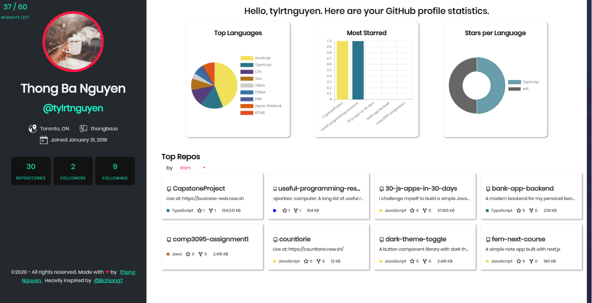

<h2 align="center">GitHub Profile Visualizer</2>

<p align="center">
  <a href="https://app.netlify.com/sites/github-visualizer/deploys" target="_blank" />
  
</p>



## 🚀 Quick start

1.  **Install Node.js using NVM.**
    ```shell
    nvm install node
    ```

2.  **Install dependencies**
    ```shell
    npm install
    ```

3.  **Start development sever**
    Your site is now running at `http://localhost:3000`!
    ```shell
    npm run start
    ```

## 💫 Build and Deploy for Production

1.  **Build a optimized version for production**
    ```shell
    npm run build
    ```
2.  **Preview the site as appeared when deploying**
    ```shell
    npm run serve
    ```